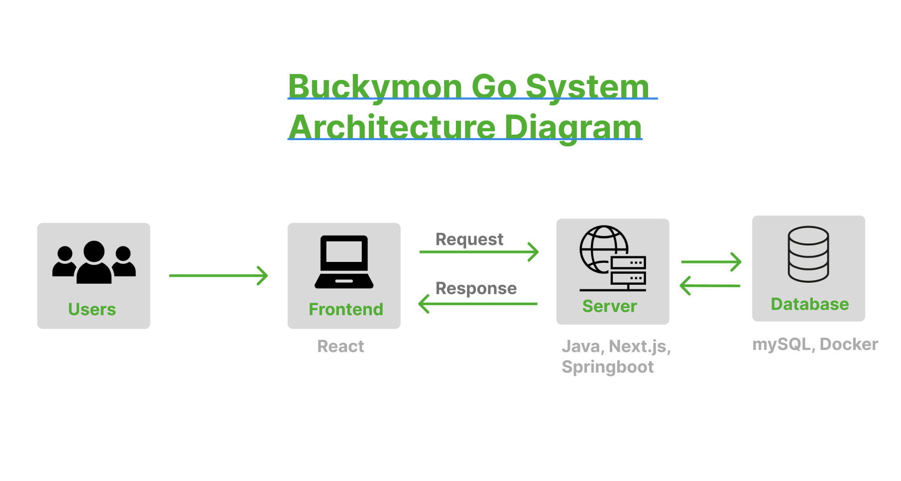
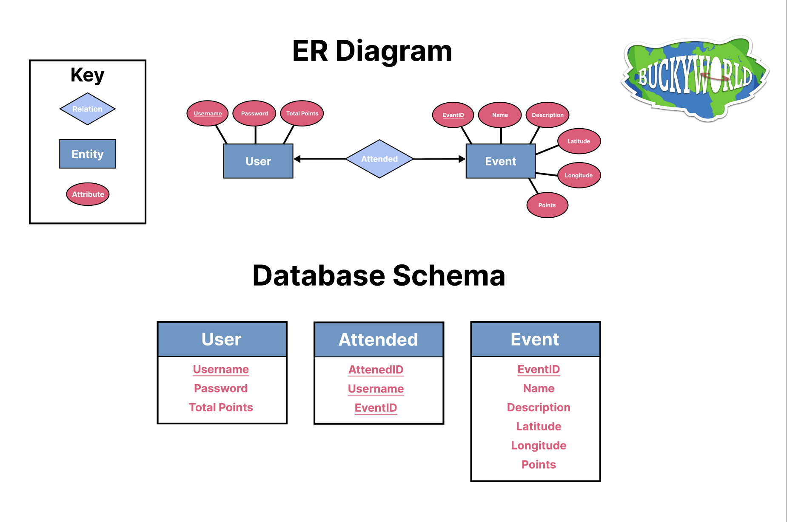

# Requirements and Specification Document

## T13 BuckyWorld

### Project Abstract

“Buckyworld” is a mobile web application designed for users to explore the UW-Madison campus. Inspired by Pokemon Go, this game leverages location data to encourage players to visit various locations and events on campus to earn points. Players are able to play the game simultaneously, and all user information is stored directly in the app. 

### Customer

The main customers of this application are UW-Madison students and faculty, as well as potential future badgers. People who are interested in promoting a certain event on campus are encouraged to use the app to encourage other people to visit their events. In the context of the purpose of the application, the CS506 teaching team are also emphasized as customers of this application.

### Running The Application

To run locally, go to the buckymongo directory and run `docker compose up --build`, make sure you have docker running on your computer

**Note**: it is not recommended to run the app on the vm until we get a pipeline set up with automatic updates

To see what is running on the vm, on your local computer, run `ssh user@cs506-team-13.cs.wisc.edu -L localhost:3000:localhost:3000` in a new terminal window

In general, to access the shared repository on the vm

run `ssh user@cs506-team-13.cs.wisc.edu`

then `cd /nobackup/buckymongo/`

you should be inside the repository

### User Requirements

#### Page Requirements

1. **Landmark Pages**

- There must exist a page for each landmark in the database.
- The general page elements shall be:
  - A square frame for the landmark's `photo`
  - A field for the `name` of the landmark
  - A field for the landmark's `description`\*
  - An "I'm here" button
    * When the landmark is unvisited, the button color shall be saturated, and when pressed, must begin the location-comparing script. Otherwise (when the landmark is visited) the button color shall be desaturated, and when pressed, must prompt popup text to show for **x** amount of time before hiding, which reads "you already checked in here today!"
  - A field for the number of points the landmark is associated with
    - When the landmark is unvisited this field's color is saturated, otherwise this field's color is desaturated.
- When "I'm here" button is pressed, the location-comparing script which returns a number (the distance between the user and the landmark) must be prompted to run. _(location-comparing script need not be accurate to fulfill this requirement, but it must return a number for this requirement to be testable)_
  * If the number returned is less than or equal to **y**, The landmark shall be set to its visited state\*\*, and the current date must be recorded. **(By way of** **not yet described behavior, see _Landmark States_ epic)** The users total point count (though not displayed on this page) shall be updated to include the number of `points` the landmark is worth. The page must be refreshed to update fields that check for landmark completeness.
  * If the number returned is greater than **y**, there is a popup indicating that the verification was unsuccessful, with text instructions to move closer to the landmark or try again.

2. **Map Page**

- The map shall be oriented on each page load such that the device's location is centered.
- Dragging a finger / clicked mouse on the screen shall cause the map view to scroll/move around, revealing and hiding landmark pins as they come in/out of the window.
- Pinching and expanding the screen should zoom in and zoom out of the map
- There shall be a way for the user to see how many points they have directly on the map page
- There shall be a button on the bottom of the screen that, on click, pulls up a sub-page\* populated with landmark thumbnails. On every load of this page, the location-comparing script shall be run for each landmark. _(note: Location-comparing script must be functioning but need not be accurate to fulfill this criterion)_ The thumbnails shall, for each landmark that exists in the database display the landmark data `photo` and `name`, as well as the location-comparing script's returned value (distance from user) for that landmark. The landmark thumbnails must be displayed left to right in order of smallest to largest distance from user. The displayed landmark thumbnails should be scrollable horizontally. There must be a **way** to exit this sub-page and return to the map page.
- On click, landmark pins and thumbnails direct user to their corresponding landmark page. _(The landmark page need not be populated to fulfill this criterion)_
- On every page-load the landmark pins and thumbnails shall check to see if their landmark is visited **(See Landmark Stages epic)**
  * In the case that the landmark that they both represent is visited, the pin may be green and thumbnail data desaturated.
  * In the case that the landmark is unvisited, the pin may be red and thumbnail data saturated.
- There may be a hamburger-menu button on the upper left that links to the menu page. _(The menu page need not be populated to fulfill this criteria)_

4. **Page to Add Landmarks** (priority = **low**)
- there must exist a page for users to add landmarks to the map page
- there shall be a way for the user to drop a pin on a location on the map
- there shall be a place for the user to enter the url of an image, description, and point value for the location

5. **User Login Page**
- For a user that has previously registered an account, there must be an area for a username and password to be entered
- there must be a login button
- upon click, the login button must route the user to the map page

6. **User Registration Page**
- For a user that does not already have an account, there must be an area for the user to enter a username of their choice (given that it is not already taken by another user), a password, and an area for them to retype the password
- there must be a sign in button
- upon click, the sign in button must route the user to the map page

7. **User Page**
- There must be a button for the user to press to log out of the application
  * Upon pressing the log out button, the button must route the user to the login page
- The users position on the leaderboard must be displayed above any buttons
- There must be a button for the user to access account settings (priority = **low**)
  * The account settings must give the option for the user to change their username and password

#### Database Requirements

7. **Landmark Table**

* There must be a database of landmarks comprised of the following fields:
  * `id` **integer** (primary key)
  * `name` **string**
  * `latitude` **double**
  * `longitude` **double**
  * `url` **string**
  * `description` **string**
  * `points` **integer** (number of points the landmark is worth)

8. **User Table**

* There must be a table of users comprised of the following fields:
  * `id` **integer** (primary key) 
  * `username` **string** (unique)
  * `password` **string**
  * `total points` **integer**

9. **Attended Table**

* There must be a table that exemplifies the relation between the attended entity and user entity comprised of the following fields:
  * `attendedId` **integer** (primary key) 
  * `username` **string** (foreign key)
  * `eventId` **integer** (foreign key)

#### Game Requirements

10. **Location Comparing**

* There shall be a location-comparing script that compares a landmark's location coordinates to the current location coordinates of the user, returning the absolute value of the distance in miles between them (Granularity of measurement must be determined by team)
* This script shall be runnable from the map page (It must be able to run for all landmarks to determine the order in which thumbnails are displayed) and the landmark pages (It must be able to run for the landmark whose page is open to determine if the user is close enough.)

11. **Earning points**

* The application must successfully update the user table in the database to reflect newly earned points for the user upon attendance of a lcoation
* The user table should increment the total points attribute to it's current value plus the point value of the location that the user visited
* The number of points must reset to 0 at the end of the day

12. **Leaderboard** (priority = **low**)

* Users must be sorted by their point value
* The User Page should display the top 10 usernames along with their respective point value

#### Account Management Requirements

12. **Account Management**

* Upon login through the login page, the existance of the user name must be verified in the user table, in other words, the username that was entered should be in the table
  * If the username was found, the password that the user entered in the interface must match the password for that username in the database
  * If the password the user entered and the password in the database do not match, the user will instead recieve an "incorrect password" alert upon pressing the login button
  * If the password the user entered and the password in the database match, the user will be routed to the map page
* Upon pressing the sign in button on the sign in page
  * If any of the password, confirmation password, or username fields are empty, the user must be notified through an alert to fill out the remaining field(s)
  * If the password and confirmation passwords do not match, the user must be notified through an alert that the password and confirmation password do not match
  * If the username already exists in the users table, the user must be notified through an alert to choose a different username
  * Otherwise, the users username and password should be stored in the users table with a default point value of 0, and the user should be routed to the map page

### Use Cases & User Stories

#### Use Cases

**Landmark Page Display and Interaction**
* 1: Display landmark details including photo, name, description, and points
* 2: Enable users to check in at landmarks, updating the landmark's state and the user's points based on location verification.
  
**Map Page Usage**
* 3: Load and center the map on the user's current location, allowing interaction like scrolling and zooming.
* 4: Display nearby landmarks and their details, sorted by proximity.
  
**User Account Registration and Login**
* 6: Facilitate new user registration, including username and password setup.
* 7: Allow existing users to log in by verifying credentials against the database.  
  
**Account Management**
* 8: Enable logged-in users to log out, redirecting them to the login page.
* 9: Offer account settings adjustments, including username and password changes.  
  
**Database Interaction**
* 10: Store and retrieve landmark and user data, including check-in records, to support the application's functionality.
  
**Game Mechanics and Location Comparison**
* 11: Implement a location-comparing script to facilitate checking in and displaying nearby landmarks accurately
* 12: Update user points based on landmark visits and reset points according to game rules.
  
**Leaderboard Dynamics**
* 13: Display a leaderboard showing users ranked by points to encourage competition and engagement.

#### Stories

* Registering and Managing Accounts
  * As a new user, I want to create an account with a unique username and password, enabling me to log in, log out, and manage my account settings.

* Participating in the Leaderboard
   * As a user, I want to see my position on the leaderboard
   * As a user I want to see the leaderboard of the top 10 users ranked (priority = **low**)

* Viewing Landmark Information
  * As a user, I want to access a page for each landmark so I can learn about it, see its photo, and check in to earn points

* Checking in at Landmarks
  * As a user, I want to press an "I'm here" button at a landmark to check in, earning points and marking it as visited.

* Navigating the Map
  * As a user, I want to view a list of nearby landmarks, sorted by distance, so I can decide which ones to visit.
  * As a user, I want to zoom in/out and drag the map to navigate to different areas of the map

* Exploring Nearby Landmarks
  * As a user, I want to view a list of nearby landmarks, sorted by distance, so I can decide which ones to visit.

### API Calls

[here](./Notes/API_Calls.md)

### User Interface Requirements

Users should be able to view a map page upon login. This map page should have markers at each location where points can be obtained. The user must also be able to scroll through the various locations at the bottom of their map page, where they can click on each “mini description” of the location to see more details. The user must be able to access their user information and progress through the hamburger button on the top left of the map page. This user page also will give the option to logout of the application. After the user clicks a location to get routed to the respective location page, the user will see a button to indicate to the app that they are nearby a location. If the user has already earned the points for this location or event, the button will be disabled. The app will notify the user through a modal whether they are close enough to the location and whether points were earned.

Click [here](https://www.figma.com/file/gwIdFXAXYb3qn6OHZ4jeXi/Wireframe-first-draft?type=design&node-id=3-61&mode=design) for a rough wireframe

### Security Requirements

There is no sensitive information that will be stored in the database. However, privacy and confidentiality are an issue if the user's username and password are entered into the application by an unwanted party.

### System Requirements

Location services must be turned on for the user’s browser.

### Specification

Note: ER diagram will be updated in sprint 2

### Technology Stack

Frontend: React + Next.js with Typescript, npm as package manager
Backend: Java Spring Boot, Gradle for build

### Standards & Conventions

[here](./CodingStandards.md)

## Team Information

### Members and strengths: 

Amelia - java, C, javascript/html/css, react/react native, android studio, graphic design

Bora - java,docker,python

Lucas - frontend, python, js/ts, java

Jordan - java, c/c++, python, little bit of html and javascript

Trishika - java, python, react/react native, javascript, html, css

Mitch - javascript, python, html, css, React, React native

### Roles:

 #### Sprint 0 and 1

PO: Amelia

SM: Lucas

#### Sprint 2

PO: Trishika

SM: Mitchell Brenner

#### Sprint 3

PO: Bora Depecik

SM: Jordan Bucher
