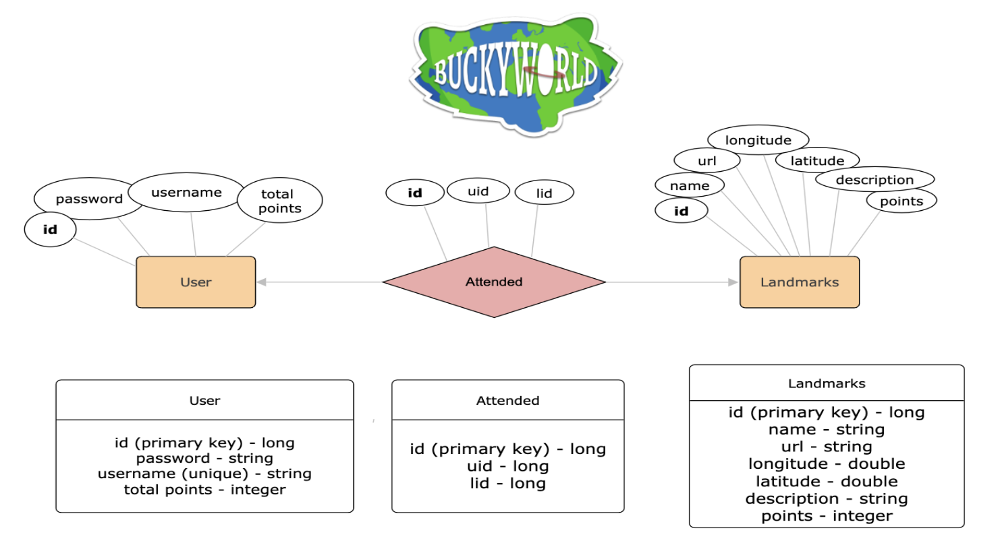

# Requirements and Specification Document

## T13 BuckyWorld

### Project Abstract

“Buckyworld” is a mobile web application designed for users to explore the UW-Madison campus. Inspired by Pokemon Go, this game leverages location data to encourage players to visit various locations and events on campus to earn points. Players are able to play the game simultaneously, and all user information is stored directly in the app. 

### Customer

The main customers of this application are UW-Madison students and faculty, as well as potential future badgers. In the context of the purpose of the application, the CS506 teaching team are also emphasized as customers of this application.

### User Requirements

1. **Landmark Pages**
**Definition of done:**

- There must exist a page for each landmark in the database.
- The general page elements shall be:
  - A square frame for the landmark's `photo`
  - A field for the `name` of the landmark
  - A field for the landmark's `description`\*
  - An "I'm here" button
    * When the landmark is unvisited, the button color shall be saturated, and when pressed, must begin the location-comparing script. Otherwise (when the landmark is visited) the button color shall be desaturated, and when pressed, must prompt popup text to show for **x** amount of time before hiding, which reads "you already checked in here today!"
  - A field for the number of points the landmark is associated with
    - When the landmark is unvisited this field's color is saturated, otherwise this field's color is desaturated.
- When "I'm here" button is pressed, the location-comparing script which returns a number (the distance between the user and the landmark) must be prompted to run. _(location-comparing script need not be accurate to fulfill this requirement, but it must return a number for this requirement to be testable)_
  * If the number returned is less than or equal to **y**, The landmark shall be set to its visited state\*\*, and the current date must be recorded. **(By way of** **not yet described behavior, see _Landmark States_ epic)** The users total point count (though not displayed on this page) shall be updated to include the number of `points` the landmark is worth. The page must be refreshed to update fields that check for landmark completeness.
  * If the number returned is greater than **y**, there is a popup indicating that the verification was unsuccessful, with text instructions to move closer to the landmark or try again.

### Use Cases & User Stories

### User Interface Requirements

Users should be able to view a map page upon login. This map page should have markers at each location where points can be obtained. The user must also be able to scroll through the various locations at the bottom of their map page, where they can click on each “mini description” of the location to see more details. The user must be able to access their user information and progress through the hamburger button on the top left of the map page. This user page also will give the option to logout of the application. After the user clicks a location to get routed to the respective location page, the user will see a button to indicate to the app that they are nearby a location. If the user has already earned the points for this location or event, the button will be disabled. The app will notify the user through a modal whether they are close enough to the location and whether points were earned.

Click [here](https://www.figma.com/file/gwIdFXAXYb3qn6OHZ4jeXi/Wireframe-first-draft?type=design&node-id=3-61&mode=design) for a rough wireframe

### Security Requirements

There is no sensitive information that will be stored in the database. However, privacy and confidentiality are an issue if the user's username and password are entered into the application by an unwanted party.

### System Requirements

Location services must be turned on for the user’s browser.

### Specification

Note: ER diagram will be updated in sprint 2

### Technology Stack

Frontend: React + Next.js with Typescript, npm as package manager
Backend: Java Spring Boot, Gradle for build

### Standards & Conventions

[here](./CodingStandards.md)

## Team Information

### Members and strengths: 

Amelia - java, C, javascript/html/css, react/react native, android studio, graphic design

Bora - java,docker,python

Lucas - frontend, python, js/ts, java

Jordan - java, c/c++, python, little bit of html and javascript

Trishika - java, python, react/react native, javascript, html, css

Mitch - javascript, python, html, css, React, React native

### Roles:

 #### Sprint 0 and 1

PO: Amelia

SM: Lucas

#### Sprint 2

PO: Trishika

SM: Mitchell Brenner

#### Sprint 3

PO: Bora Depecik

SM: Jordan Bucher
